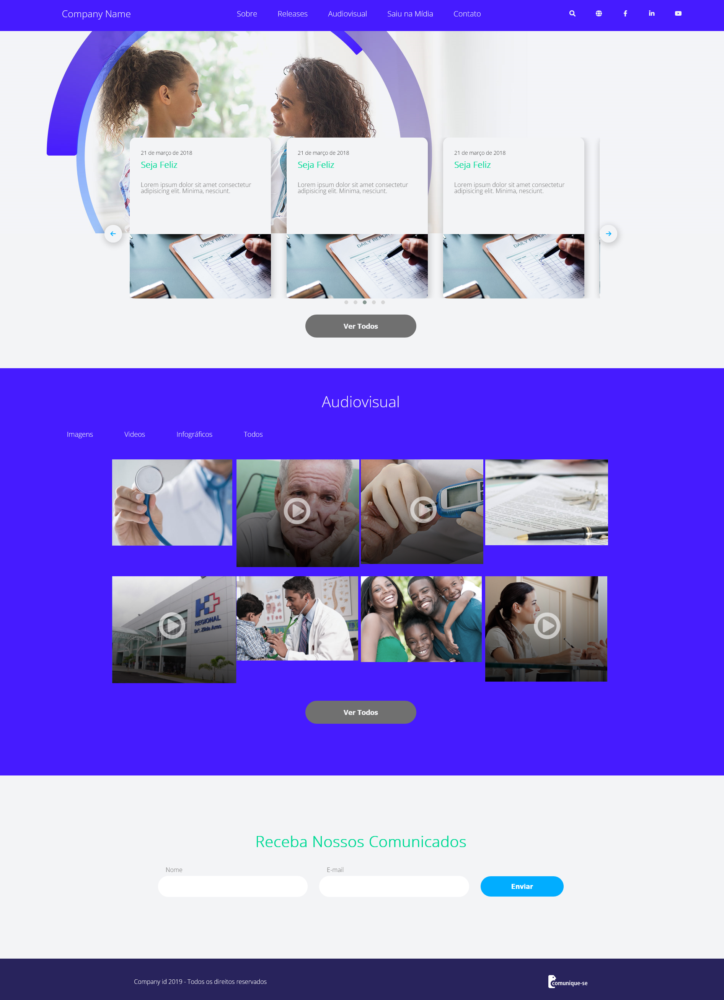

# Projeto Vaga de Estágio front-end
Projeto teste para processo seletivo, projeto finalizado dia 26/03/2022 - as 14:54

Foi utilizado sass, jquery e js.

## Objetivo

O Desafio do projeto era recriar uma landing page criada no Adobe XD com todas as funcionalidades.

## Demonstração

*Imagem do projeto para visualização*

## Como acessar?

Você pode testar o projeto [Aqui](https://health-project-intern.netlify.app/)!
